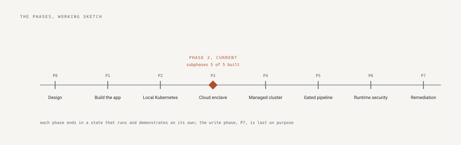

# control-plane

One person's public record of building a security engineering
program with an AI agent doing the typing and a human deciding
everything.

It exists to show, with evidence rather than claims, that agent-built
software can be held to a professional standard: every decision
recorded with what was rejected, every control proven by a test,
every release attested, and every agent mistake written down with
what caught it.

What is in it:

- **role-call**: an inventory and review tool for cloud service
  accounts and roles. Import snapshots, see who owns what, run review
  campaigns. 149 tests, 55 recorded decisions, five outside ratings.
- **build-doctrine**: the rulebook the program builds under, and the
  commands that score any repository against it.
- **secure-expense-mvp**: a small finished application, hardened and
  mutation-tested, kept as the reference.
- **The program documents**: what is monitored, how recovery works,
  how every repository is gated, and the next phase's plan.

The rendered site is this repository, served at
https://tltaylor1.github.io.

## The parts

| Repository | What it is, and what it proves |
|---|---|
| [role-call](https://github.com/tltaylor1/role-call) | A governance tool for non-human identities: import cloud identity snapshots, derive state from history, put owners and review campaigns on the record. The program's flagship: building in motion, with the decision record growing under load |
| [secure-expense-mvp](https://github.com/tltaylor1/secure-expense-mvp) | A small expense tool, finished and hardened: every request-path gate tied to the failure it prevents, mutation-tested, complete on purpose |
| [build-doctrine](https://github.com/tltaylor1/build-doctrine) | The doctrine: standards where every rule records the incident that produced it, the enforcement mapping, and the promotion path from human check to automated gate |
| aws-platform | Arrives with Phase 3: generic Terraform modules for an organization, its baseline, account vending, and keyless deploy federation |

## The program documents

The concerns that span repositories live here, not buried in any one
of them:

- [PHASE-3.md](PHASE-3.md), the current phase's public plan, fixed
  before the work.
- [MONITORING.md](MONITORING.md), what is watched at each layer, its
  signal, and who hears it, with unfilled layers stating themselves.
- [BCDR.md](BCDR.md), recovery split between rebuildable-from-code and
  actual state, with drills that carry their last-run date and expire.
- [PIPELINES.md](PIPELINES.md), how every repository is gated, and the
  infrastructure-as-code posture.

## The method, in five lines

Design before code, with the plan fixed and published before building
starts. Every change through a pull request: the agent proposes under
its own installed-app identity, required checks gate, a human
approving review is required, and the merge is the review's receipt.
Every figure a document states is asserted against the running system
or gated against its source. Every incident becomes a rule, and the
second identical hand-fix becomes automation. What is deliberately
absent is recorded next to what exists, because an undocumented gap
and a considered exclusion look identical from outside.

## The arc

Eight phases: design; the application; local Kubernetes; the cloud
enclave as code; managed Kubernetes; the security-gated pipeline;
runtime detection; human-triggered remediation last, because write
access to anyone's cloud account is trust that must be earned by
everything before it. Phases one and two are complete and tagged
(v0.2.0, with verifiable build provenance); Phase 3 is in progress.
